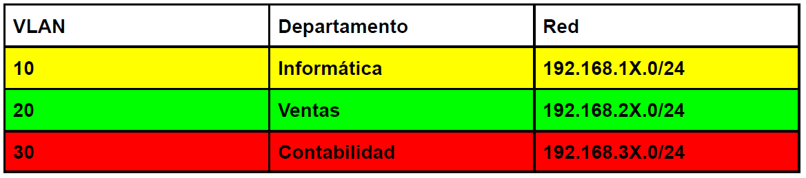
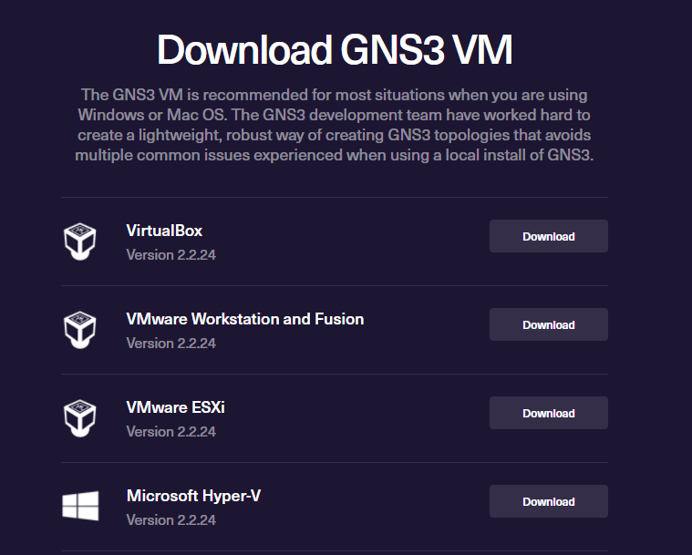
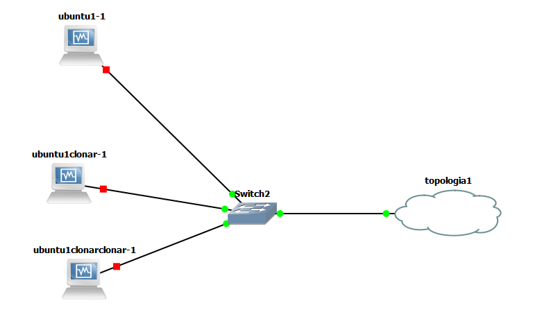

# Practica 2 GRUPO 9

   <p align="center">
    
   </p> 

---------------------------------------------------------------------------
### INTEGRANTES
- ERICK VALENZUELA
- FERNANDO AMBROSIO
- AARON JUAREZ 
- SOHANY LOPEZ
---------------------------------------------------------------------------
### HERRAMIENTAS UTILIZADAS
- Equipo.
    - 4 computadores con sistema operativo libre *"windows"*
    - 4 computadoras con sistema de virtualiacion *"virtual box"*
- Software.
    - Administradors VPNs *"OpenVPN"*
    - GNS3 instalados en los hosts físicos.
    - Software de virtualización (VMWare o Virtual Box) instalados y configurados para uso con GNS3.
- Plataforma
    - Google Cloud Plataform (GCP)
---------------------------------------------------------------------------
### DESCRIPCION DE LA PRACTICA
Configuracion y administracion de dispositivos de una infraestructura de red para una compañía, realizando el diseño de topología que será utilizado como infraestructura de red, configurandose para proveer comunicación de acuerdo a las necesidades que se indican.

La compañía cuenta con 3 departamentos: informática, contabilidad y ventas. Se debe proveer comunicación entre los usuarios del mismo departamento y con su servidor web, por ejemplo, los usuarios del departamento de ventas no se podrán comunicar con ningún otro departamento solamente con su departamento

   <p align="center">
    
   </p>

- REQUISITOS
    - Garantizar que los equipos del departamento de ventas puedan comunicarse únicamente con el sitio web de ventas y otros equipos del propio departamento.
    - Garantizar que los equipos del departamento de contabilidad puedan comunicarse únicamente con el sitio web de contabilidad y otros equipos del propio departamento.
    - Garantizar que los equipos del departamento de informática puedan comunicarse únicamente con el sitio web de informática y otros equipos del propio departamento.
    - Entre el departamento de contabilidad, informática y ventas no debe haber comunicación.

- TOPOLOGIAS
 <p align="center">
    
   </p>

---------------------------------------------------------------------------
### PASOS PARA CREACION DE UNA RED VLAN

La topología de la red sera simulada sobre máquinas físicas. Para ello se
implementaran dispositivos Cloud en *GNS3*.

<p align="center">
    
</p>

1. Configuración de la máquina virtual de *GNS3* para poder utilizar VirtualBox 
    1. Para poder configurar *VIRTUALBOX* de tal modo que se puede utilizar una maquina virtual en *GNS3* debemos descargar la VM de gns3 para el sistema operativo linux, esta maquina virutal de gns3 lo que permite es poder conectar gns3 con una maquina virtual que tenga el sistema cualquier sistema operativo y poder utlizarla en el software de simulacion y puede sar parte de nuestra topologia, para esto esta debera ser descargada en siguiente enlace:
        - [https://www.gns3.com/software/download-vm](https://www.gns3.com/software/download-vm)

        En el enlace se mostrar la siguiente pantalla y debemos descargar la que dice VirtualBox en  su version mas actualizada

        

    2. Al descargar la VM de gns3 para *VIRTUALBOX* sera debera agregar la maquina virtual a este, simplmente dando doble click sobre el archivo descargado y luego en importar archivo.

        <p align="center">
            
        </p>

        

    3. Como siguiente paso debemos ir a gns3 a configurar nuestra vm virtual que acabamos de agregar a VIRTUALBOX, para esto ireremos a la pestaña de *EDIT* y luego en *PREFERENCES*
        <p align="center">
            
        </p>

    4. luego se nos abrira la siguiente ventana donde debemos ubicarnos en GNS3 VM, y en el apartado de *VIRTUALIZACION ENGINE* deberemos de seleccionar VIRTUALBOX, luego de esto en el apartado de SETTINGs le daremos en el boton de refresh para que gns3 obtenga nuestra maquina recien agregada.
        

2. Configuración de las 2 topologías en GNS3
    1. Para poder configurar las dos topologias en *GNS3* primero debemos de agregar los elementos necesarios para poder crearla, en este caso se utilizaron los elementos *VPCS, MAQUINA VIRTUAL LINUX, CLOUD, SWITCH CAPA 3.*
        <p align="center">
            
        </p>
    
    2. lo siguiente sera armar nuestra topologia 1, la cual esta conformada de tres partes, una topologia 1A, 1B y 1C, cada una esta conformada por una maquina del tipo *VPCS* y una *MAQUINA VIRTUAL CON SO LINUX*, como se muestra en las siguientes imagenes.
         
         
         
         
         Las anteriores topologias tambien tienen elementos como los son los switch capa 2 y elementos cloud, asi mismo cada una de estas topologias estara distribuida entre las maquinas fisicas de los integrantes del grupo una topologia por cada integrante del grupo.

    3. Para poder agregar nuestras maquinas virtuales a nuestro simulador de red debemos de realizar lo siguiente
        - debemos ir nuevamente al apartado de edit y prefereces en gns3 
            <p align="center">
            
            </p>
        - luego iremos al partado de VIRTUALBOX en su sub item VirtualBox VMs y se seleccionara el boton de *NEW*
            <p align="center">
            
        </p>

        - Luego de lo anterior aparecera la siguiente pestaña donde debemos de dar *NEXT*
            <p align="center">
            
            </p>
        - Siguiente paso aparecere la siguiente ventana, donde nos desplegara la lista de maquinas virtuales que tenemos disponibles en VIRTUALBOX, tal y como se muestran en las siguientes imagenes y solo debemos seleccionar la que nos interesa sea parte de nuestra simulacion, si en dado caso sean varias maquinas solo debemos repetir este paso las veces necesarias hasta agregar todas las que nos interezan.
            <p align="center">
            
            </p>

            - maquinas virtuales disponibles
            <p align="center">
            
            </p>

            *NOTA*: PARA TODOS LOS PASOS ANTERIORES YA DEBEMOS CONTAR CON MAQUINAS VIRTUALES CREADAS EN NUESTRO VIRTUAL BOX.

        - Como ultimo paso para lograr que toda nuestra topologia se comunique la topologia 1a sera modificada para para que las topologias que estan distribuidas en cada uno de los integrantes del grupo, quedando de la siguiente manera.
            <p align="center">
            
            </p>
            
            esta topologia modificada ahora tendra 4 switch capa 2 y 3 cloud, conservando de la topologia original las dos maquinas la virtual y la VPCS.
        
    4. Como siguiente paso sera la configuracion de la topologia 2, como vimos en los pasos anteriore en la topologia 1a modificada se encuentra una cloud que hace referencia a la topologia 2, este nube es la que tenemos que configurara para logarar la conexion con nuestra topologia 2 que al igual que las anteriores se encuentra en la pc de un integrante del grupo, para este topologia debemos de tener el siguiente esquema en gns3.
         <p align="center">
            
        </p>

        - como primer paso paso para poder configurar esta topologia debemos agregar 3 maquinas virtuales, para esto debemos seguir los pasos del inciso III, anterior a este, luego de agregar las maquinas virtuales debemos configurar nuestra nube o cloud con los puertos necesarios para conectar con la topologia 1, las cuales son las siguientes.
            <p align="center">
            
            </p>

            ```
            Local port: 20010
            Remote host: 10.8.0.5 
            *en este caso sera el host remoto de la maquina que tenga la topologia 1a modificada*
            Remote port: 30010
            ```
3. Configuración de las VPCs
    1. para poder configurar las vpc de cada uno de las topologias, 1a, 1b, 1c, lo que se debe de hacer es iniciar la maquina, y luego darle en el apartado de consola como se muestra en la siguiente imagen.
        <p align="center">
        
        </p>
    2. Ño siguiente que se realiza en cada uno de las VPCs es asiganarles la ip destina a cada una estas, el procedimiento es exactamente el mismo para cada VPCS. tal y como se muestra en la imagen, este proceso se realiza en la consola de cada una las VPCS.
        <p align="center">
        
        </p>

        - comandos para configurar VPCs topologia 1a
            ```
            ip 192.168.29.15/24 255.255.255.0 192.168.29.24
            ```
        - comandos para configurar VPCs topologia 1b
            ```
            ip 192.168.39.15/24 255.255.255.0 192.168.39.24
            ```
        - comandos para configurar VPCs topologia 1c
            ```
            ip 192.168.19.15/24 255.255.255.0 192.168.19.24
            ```
4. Configuración de las máquinas virtuales
5. Instalación y configuración de los servidores web
    1. como primer paso, ya debemos tener las maquinas virutales instaladas de en virtual box, con el sistema operativo linux.

6. Pings entre los clientes y entre los servidores web de los departamentos
correspondientes
7. Visualización de la página web desde el Host Virtual Cliente